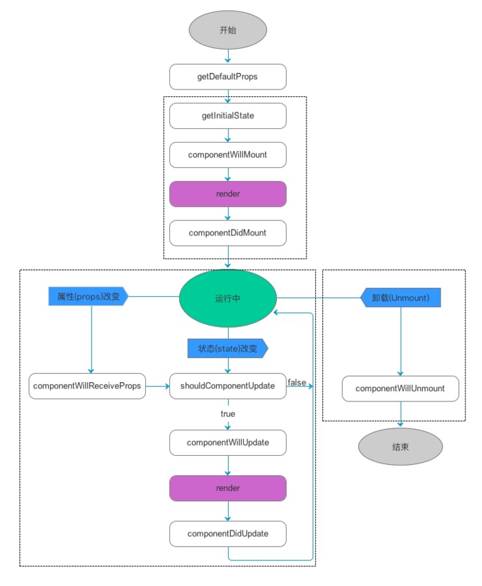

<center>React学习</center>

## React环境基础搭建与安装

1. nodejs下载与安装

   安装完成后执行如下指令，确定安装成功

   ```bash
   node -v
   ```

   ```bash
   npm -v
   ```

2. 快速新建react项目

   全局安装create-react-app, 命令行依次输入以下命令，完成react项目的搭建

   ```bash
   npm install -g create-react-app
   create-react-app my-react-app
   cd my-react-app
   npm start
   ```

   浏览器输入localhost:3000，即可运行。

   ​

## ES6语法巩固（待完成）

1. let & const

   let声明变量，用法类似于var，只是声明的变量只在let命令所在代码块内有效。

   ```javascript
   for (let i = 0; i< 10; i++) {
     // ...
   }
   console.log(i) // 报错
   ```

   const声明一个只读的常量，一旦声明了，就不能改变。只能在声明的位置后面使用，且不能重复声明。

   ```javascript
   const PI = 3.1314;
   PI = 3 // 错误
   ```

2. 变量的解构赋值

   2.1 数组的解构赋值

   ```javascript
   let [a, b, c] = [1, 2, 3] // 从数组中提取值，按照对应位置，对变量赋值
   let [foo] = []; // 变量解构不成功 foo 等于 undefined
   let [x = true] = []; // 设置x的默认值为true
   let [y = 1] = [null]; // y值为null。 只有当一个数组成员严格等于undefined，默认值才会生效。即null !== undefined

   let [head, ...tail] = [1, 2, 3, 4];
   head // 1
   tail // [2, 3, 4]

   ```

   2.2对象的解构赋值

   变量必须与属性同名，才能取到正确的值，与位置无关。

   ```javascript
   let { foo, bar } = { foo: "aaa", bar: "bbb" }; // foo值为"aaa", bar值为"bbb"
   let { bar, foo } = { foo: "aaa", bar: "bbb" }; // foo值为"aaa", bar值为"bbb"
   let { x = 3 } = {}; // 指定默认值
   ```

   如果变量名与属性名不一致

   ```javascript
   let { foo: baz } = { foo: "aaa", bar: "bbb" }; // baz值为"aaa"
   ```

   2.3 字符串的解构赋值

   ```javascript
   const [a, b, c, d, e] = 'hello';
   a // "h"
   b // "e"
   c // "l"
   d // "l"
   e // "o"

   let { length: len } = 'hello'; // len值为5
   ```

   2.4 函数的解构赋值

   函数`add`的参数表面上是一个数组，但在传入参数的那一刻，数组参数就被解构成变量`x`和`y`。对于函数内部的代码来说，它们能感受到的参数就是`x`和`y`。

   ```javascript
   function add([x, y]){
     return x + y;
   }
   add([1, 2]); // 3

   // map遍历
   [[1, 2], [3, 4]].map(([a, b]) => a + b); // [3, 7]

   // 使用默认值
   function move({x = 0, y = 0} = {}) {
     return [x, y];
   }
   move({x: 3, y: 8}); // [3, 8]
   move({x: 3}); // [3, 0]
   move({}); // [0, 0]
   move(); // [0, 0]
   ```

   解构使用情况是，大多是对JSON数据的提取，加载模块时，指定需加载模块的方法。

3. 字符串的扩展

   includes() 表示是否找到了参数字符串

   startsWith() 表示参数字符串是否在原字符串的头部。

   endsWith() 表示参数字符串是否在原字符串的尾部

   使用第二个参数`n`时，`endsWith`的行为与其他两个方法有所不同。它针对前`n`个字符，而其他两个方法针对从第`n`个位置直到字符串结束。

   ```javascript
   let s = 'Hello world!';
   s.startsWith('Hello'); // true
   s.endsWith('!'); // true
   s.includes('o'); // true

   s.startsWith('wrold', 6); // true
   s.endsWith('Hello', 5); // true
   s.includes('Hello', 6); // false
   ```

   padStart(), padEnd()

   如果某个字符串不够指定长度，会在头部或尾部补全。`padStart()`用于头部补全，`padEnd()`用于尾部补全。

   ```javascript
   '1'.padStart(10, '0') // "0000000001"
   '12'.padStart(10, '0') // "0000000012"
   '123456'.padStart(10, '0') // "0000123456"

   '12'.padStart(10, 'YYYY-MM-DD') // "YYYY-MM-12"
   '09-12'.padStart(10, 'YYYY-MM-DD') // "YYYY-09-12"
   ```

   模板字符串

   模板字符串是增强版的字符串，用 (`)标识。可以当作普通字符串使用，也可以用来定义多行字符串，或者在字符串中嵌入变量。

   ```javascript
   `${x} + ${y} = ${x + y}`
   // "1 + 2 = 3"

   `${x} + ${y * 2} = ${x + y * 2}`
   // "1 + 4 = 5"
   ```

4. 数值的扩展

   Number.isFinite(), Number.isNaN()

   `Number.isFinite()`用来检查一个数值是否为有限的。

   `Number.isNaN()`用来检查一个值是否为`NaN`。

   ```javascript
   Number.isFinite(15); // true
   Number.isFinite(0.8); // true
   Number.isFinite(NaN); // false
   Number.isFinite(Infinity); // false
   Number.isFinite(-Infinity); // false
   Number.isFinite('foo'); // false
   Number.isFinite('15'); // false
   Number.isFinite(true); // false

   Number.isNaN(NaN) // true
   Number.isNaN(15) // false
   Number.isNaN('15') // false
   Number.isNaN(true) // false
   Number.isNaN(9/NaN) // true
   Number.isNaN('true' / 0) // true
   Number.isNaN('true' / 'true') // true
   ```

   `Number.MAX_SAFE_INTEGER`和`Number.MIN_SAFE_INTEGER`这两个常量，用来表示这个范围的上下限。

   `Number.isSafeInteger()`则是用来判断一个整数是否落在这个范围之内。

   ```javascript
   Number.MAX_SAFE_INTEGER === Math.pow(2, 53) - 1
   // true
   Number.MAX_SAFE_INTEGER === 9007199254740991
   // true
   Number.MIN_SAFE_INTEGER === -Number.MAX_SAFE_INTEGER
   // true
   Number.MIN_SAFE_INTEGER === -9007199254740991
   // true

   Number.isSafeInteger('a') // false
   Number.isSafeInteger(null) // false
   Number.isSafeInteger(3) // true
   Number.isSafeInteger(1.2) // false
   Number.isSafeInteger(9007199254740990) // true
   Number.isSafeInteger(9007199254740992) // false
   ```

    `Math.sign`方法用来判断一个数到底是正数、负数、还是零。对于非数值，会先将其转换为数值。

   ```javascript
   Math.sign(-5) // -1
   Math.sign(5) // +1
   Math.sign(0) // +0
   Math.sign(-0) // -0
   Math.sign(NaN) // NaN
   ```

   `Math.cbrt`方法用于计算一个数的立方根。

   ​

## React基本用法

### JSX

在编译之后呢，JSX 其实会被转化为普通的 JavaScript 对象。

```jsx
const element = (
  <h1 className="greeting">
    Hello, world!
  </h1>
);
```

```jsx
const element = React.createElement(
  'h1',
  {className: 'greeting'},
  'Hello, world!'
);
```

上面两种写法相同

### 元素渲染

要将React元素渲染到根DOM节点中，我们通过把它们都传递给 `ReactDOM.render()` 的方法来将其渲染到页面上。在实际生产开发中，大多数React应用只会调用一次 `ReactDOM.render()` 。

```jsx
function formatName(user) {
  return user.firstName + ' ' + user.lastName;
}

const user = {
  firstName: 'Harper',
  lastName: 'Perez'
};

const element = (
  <h1>
    Hello, {formatName(user)}!
  </h1>
);

ReactDOM.render(
  element,
  document.getElementById('root')
);
```

React DOM 会比较元素内容先后的不同，在渲染过程中只会更新改变了的部分。

### 组件与Props

组件的定义分为函数定义和类定义，这两种组件在React中是相同的，使用类就允许我们使用其它特性，例如局部状态、生命周期钩子。

函数定义是最简单的定义方式：

```jsx
function Demo (props) {
  return <h1>Hello, { props.name }</h1>
}
```

使用class定义组件:

```jsx
class Demo extends React.Component {
  render () {
    return (<h1>hello, { this.props.name }</h1>);
  }
}
```

组件可以引用其它组件，即可以抽象一些层次细节，如按钮，表单，对话框。

```jsx
function Welcome(props) {
  return <h1>Hello, {props.name}</h1>;
}

function App() {
  return (
    <div>
      <Welcome name="Sara" />
      <Welcome name="Cahal" />
      <Welcome name="Edite" />
    </div>
  );
}
```

当UI中有一部分重复使用过了好多次，或者本身足够复杂，都是可以抽象出一个可复用的组件。

```jsx
function UserInfo(props) {
  return (
    <div className="UserInfo">
      <Avatar user={props.user} />
      <div className="UserInfo-name">
        {props.user.name}
      </div>
    </div>
  );
}
```

Props的只读性，一个组件的props是不能被自己修改的，所有的React组件都必须像纯函数使用props

```jsx
function sum (a, b) {
  return a + b;
}
```

### state

状态与属性十分相似，但是状态是私有的，完全受控于当前组件。

```jsx
class Clock extends React.Component {
  constructor (props) {
    super(props);
    this.state = {
      date: new Date()
    }
  }
  render () {
    return (
      <div>
        <h1>time: {this.state.date.toLocaleTimeString()}</h1>
      </div>
    );
  }
}
```

更改state方法

```
this.setState({
  date: new Date()
})
```

State 的更新是异步的,调用`setState` 组件的state并不会立即改变。

```jsx
state = {
  quantity: 0
}
add = () => {
  this.setState((preState, props) => {
    console.log(preState.quantity); // preState先前的状态, props当前最新的属性props
    return { quantity: preState.quantity + 1 }
  });
  console.log(this.state.quantity) // 0
}
```

当调用`setState`修改组件状态时，只需要传入发生改变的`State`，而不是组件完整的`State`，因为组件`State`的更新是一个浅合并的过程。

```jsx
state = {
  a: 1,
  b: 2
}
this.setState({
  a: 3
});
```

### 生命周期 


- Mounting：已插入真实DOM

  `constructor()` 在组件的实例创建时调用，可以初始化state。

  `componentWillMount()` 在组件渲染之前调用，在这里可以修改state不会触发重新渲染。

  `render()` 渲染组件，检查this.state和this.props返回react元素，也可以返回null或false，只能有一个顶级组件，不能改变组件的状态。组件首次加载，组件内部state改变，组件接收到新的props时都会触发render渲染，并且只会渲染改变了的节点。

  `componentDidMount()` 组件渲染完成后调用，在这里初始化DOM节点，可以进行网络请求拉取远端数据。修改state会触发组件的重新渲染。

- Updating：正在被重新渲染

  props和state的改变会让组件重新渲染

  `componentWillReceiveProps(nextProps)` 组件接收到新的props时调用，新的props作为其参数nextProps使用，在这里可以更改组件的props和state。

  `shouldComponentUpdate(nextProps, nextState)` 组件是否渲染新的props或state，返回false表示跳过后续componentWillUpdate，render，componentDidUpdate方法。在组件的首次渲染和使用forceUpdate()时不会调用此方法。通常不怎么使用此方法。

  `componentWillUpdate(nextProps, nextState)` 在接收到新的props或者state后，进行渲染之前调用，此方法中不允许更新state或props，此时可以修改state。组件初次渲染不调用此方法。 

  `componentDidUpdate()` 完成渲染新的props或state后调用，可在这里操作新的DOM元素。

- Unmounting：已移除真实DOM

  `componentWillUnmount()` 组件被移除之前调用，在这里执行清理操作，如清除定时器，监听器。


其他：通过extends React.Conponent给组件初始化不会执行getDefaultProps和getInitialState。

```jsx
class Demo extends React.Component {
  // 初始化props
  static defaultProps = {
    onClick: null,
    className: '',
    text: '默认'
  }
  // 初始化state
  constructor (props) {
	super(props);
    this.state = {
      time: 0,
      log: []
    }
  }
}
```

调用 `forceUpdate()` 会导致组件跳过 `shouldComponentUpdate()` ，直接调用 `render()`。

### 处理事件

当使用一个ES6定义一个组件时，通常的一个事件处理程序是类上的一个方法。

```jsx
class Toggle extends React.Component {
  constructor (props) {
    super(props);
    this.handleClick = this.handleClick.bind(this);
  }
  handleClick () {
    console.log("handleClick");
  }
  render () {
    return (
      <div>
      	<button onClick="this.handleClick"></button>
      </div>
    );
  }
}
```

不调用bind(this),使用属性初始化语法。

```jsx
class Toggle extends React.Component {
  handleClick = () => {
    console.log("handleClick");
  }
  render () {
    return (
      <div>
      	<button onClick={this.handleClick}></button>
      </div>
    );
  }
}
```

不使用属性初始化语法

```jsx
class Toggle extends React.Component {
  handleClick () {
    console.log("handleClick");
  }
  render () {
    return (
      <div>
      	<button onClick={(e) => this.handleClick(e)}></button>
      </div>
    );
  }
}
```

传递参数给事件处理

```jsx
<button onClick={(e) => this.handleClick(id, e)}>BTN</button>
<button onClick={this.handleClick.bind(this,id)}>BTN</button>
```


## React进阶

### 组件及其交互通信

父组件向子组件传值，通过 `props` 属性传递，在父组件给子组件设置 `props`，然后子组件就可以通过 `props` 访问到父组件的数据或者方法，这样就搭建起了父子组件间通信的桥梁。

```jsx
class Parents extends React.Component{
  constructor(props){
    super(props);
    this.state = {
      dataList: [],
      name: 'parents'
    }
  }
  logChildName = (cname) => {
    console.log(cname);
  }
  render () {
    return (
      <div>
      	<Child alertHandler={this.logChildName} />
      </div>
    );
  }
}
```

子组件通过父组件传递的方法来传递值。

```jsx
class Child extends React.Component {
  constructor(props){
    super(props);
    this.state = {
      name: 'Child'
    }
  }
  handleClick = () => {
    this.props.alertHandler(this.state.name);
  }
  render(){
    return (
      <div>
        <button onClick={this.handleClick}>show child name</button>
      </div>
    );
  }
}
```

### 网络通信

在react项目中获取数据的工具比较多，比如`fetch` `axios` 。一般获取网络请求数据是在`componentDidMount()`中操作，然后通过`promise`获取数据。

```jsx
import axios from 'axios';
import React from 'react';
import Table
const urlString = 'http://localhost:3000/';
export default class TestAxios extends React.Component{
  constructor(props){
    super(props);
    this.state = {
      tableData: []
    }
  }
  // get获取数据
  getTableData () {
    axios.get(urlString,{
      headers: {}, // 设置响应头
      params: {
        page: 1,
        limit: 10
      }
    })
      .then((res) => {
      // 得到值
      return res.data;
    })
      .then((data) => {
      // 进行处理
      this.setState({
        tableData: data
      })
    })
      .catch((error) => {
      // 错误处理
      console.log(error);
    })
  }
  componentDidMount(){
    this.getTableData();
  }
  render () {
    return (
      <div>
        {
          /* Table 用于展示tableData */
        }
      	<Table data={this.state.tableData} />
      </div>
    );
  }
}
```

发送`post`请求，通过`promise`处理返回数据。

```jsx
import axios from 'axios';
import React from 'react';
const urlString = 'http://localhost:3000/';
export default class TestPostAxios extends React.Component {
  constructor (props) {
    super(props);
    this.state = {
      vaule: ''
    }
  }
  // 更改input的value
  handleChange = (event) => {
    this.setState({
      value: event.target.value
    });
  }
  // 提交操作
  handleSubmit = (event) => {
    console.log('submit value ' + this.state.value);
  }
  // post请求
  addName = (name) => {
    axios.post(urlString, {
      name,
    }, {
      headers: {}
    })
      .then((res) => {
      console.log(res.data);
    })
      .catch((error) => {
      consoloe.log(error);
    })
  }
  render () {
    return (
      <div>
      	<form onSubmit={this.handleSubmit}>
          <label>
          	name: 
            <input type="text" value="this.state.value" onChange={this.handleChange} />
          </label>
        </form>
      </div>
    );
  }
}
```

一个项目中get或post请求中的地址主机和端口基本不变，也可以自己再讲axios封装一次，让网络请求业务和react的视图分开方便管理。

### Refs用法

控制一些`DOM`原生的效果，如输入框的聚焦效果和选中效果等；触发一些命令式的动画；集成第三方的`DOM`库。如果要实现的功能可以通过声明式的方式实现，就不要借助Ref。

如果作用在原生的`DOM`元素上，通过`Ref`获取的是`DOM`元素，可以直接操作`DOM`的`API`。

```jsx
class CustomTextInput extends React.Component {
  constructor(props) {
    super(props);
    this.focusTextInput = this.focusTextInput.bind(this);
  }

  focusTextInput() {
    // 获取DOM元素后可以直接操作DOM API
    this.textInput.focus();
  }

  render() {
    // 通过Ref获取DOM元素，再保存在实例变量focusTextInput中
    return (
      <div>
        <input
          type="text"
          ref={(input) => { this.textInput = input; }} />
        <input
          type="button"
          value="Focus the text input"
          onClick={this.focusTextInput}
        />
      </div>
    );
  }
}
```

在子节点上暴露一个特殊的属性，子节点将会获得一个函数属性，并将其作为 `ref` 属性附加到 DOM 节点。

```jsx
function CustomTextInput(props) {
  return (
    <div>
      <input ref={props.inputRef} />
    </div>
  );
}

class Parent extends React.Component {
  render() {
    return (
      <CustomTextInput
        inputRef={el => this.inputElement = el}
      />
    );
  }
}
```

### 深入JSX

- 组件定义必须以大写字母开头

- 不能使用一个普通的表达式作为 React 元素的标签。

- jsx中的props属性可以是JavaScript表达式，字符串字面量。

- 属性默认值为true。

- 属性扩展

  ```jsx
  function App () {
    const props = {firstName: 'Ben', lastName: 'Hector'};
    return <Greeting {...props} />;  
  }
  ```

- JSX中的Children可以是字符串字面量，多个JSX元素，JavaScript表达式，回调函数。Booleans、Null、Undefined会被忽略。


### React Router

#### 安装

react router通过npm安装，命令行输入：

```bash
npm install --save react-router-dom
```

#### 基本使用

引入react-router-dom，设置项目的router 如下，当输入地址为`/` 页面输出为App组件页面，当地址为`/about/id` 页面输出为About组件页面，当地址输入为`/topics` 页面输出为Topics组件页面。

```jsx
import { BrowserRouter as Router, Route, Link, Switch } from 'react-router-dom';
import ReactDOM from 'react-dom';
import React from 'react';
import App from './../pages/App';
import About from './../pages/About';
import Topics from './../pages/Topics';

class RouterApp extends React.Component {
  render (){
    return (
      <Router>
        <Switch>
          <Route path='/' component={App} />
          <Route path="/about/:id" component={About}/>
          <Route path="/topics" component={Topics}/>
        </Switch>
      </Router>
    );
  }
}

ReactDOM.render(<RouterApp />, document.getElementById('root'));
```

获取地址URL参数，通过this.props.match可以获取url参数，params参数。如果地址输入`/about/123` 。通过params也可以完成页面之间的传值。

```jsx
const { url, params } = this.props.match;
console.log(url); // /about/123
console.log(params); // {id: 123}
```

当路径未匹配path时应当有404界面。

```jsx
<Route component={NoMatch} />
```

当组件中需要用到跳转时需使用`Link` 其中的传递的参数可以在`props` 的`location` 中获取。

```jsx
import {Link} from 'react-router-dom';
export default class RouterTest extends React.Component {
  render () {
    return (
    	<Link to={{
          pathname: '/index',
          search: '?sort=name',
          hash: '#the-hash',
          state: { fromDashboard: true }
        }}
        >跳转to</Link>
    );
  }
}
```

也可以通过函数传值。

```jsx
// 向详情页传递要传递的值
clickHandler(value) {
      browserHistory.push({
        pathname: '/detail/' + value,
        query: {
         billName: value.brandNm,
         billTittle: value.ticketNm,
         billImg: value.billPicPath,
         billId: value.billId
        },
      })
      console.log(value);
  }
}
```

当然如果需要重定向到新的一个地址就可以用`Redirect` 来实现。

```jsx
import { Route, Redirect } from 'react-router'

<Route exact path="/" render={() => (
  loggedIn ? (
    <Redirect to="/dashboard"/>
  ) : (
    <PublicHomePage/>
  )
)} />
```

传值方式同`Link` 一样。

```jsx
<Redirect to={{
  pathname: '/login',
  search: '?utm=your+face',
  state: { referrer: currentLocation }
}}/>
```

#### 其他v3与v4

[https://www.jianshu.com/p/bf6b45ce5bcc](https://www.jianshu.com/p/bf6b45ce5bcc)

[https://blog.csdn.net/sinat_17775997/article/details/69218382](https://blog.csdn.net/sinat_17775997/article/details/69218382)

### Webpack

#### 安装

本地安装

```bash
npm install --save-dev webpack
npm install --save-dev webpack@<version>
```

全局安装

```bash
npm install --gobal webpack
```

#### 基本使用

```js
const path = require('path');

module.exports = {
  entry: './src/index.js', // 入口文件
  output: { // 出口文件
    filename: 'bundle.js',
    path: path.resolve(__dirname, 'dist')
  }
};
```

资源管理

css加载，需安装css-loader和style-loader并在module配置

```bash
npm install --save-dev style-loader css-loader
```

```js
const path = require('path');

  module.exports = {
    entry: './src/index.js',
    output: {
      filename: 'bundle.js',
      path: path.resolve(__dirname, 'dist')
    },
   module: {
     rules: [
       {
         test: /\.css$/,
         use: [
           'style-loader',
           'css-loader'
         ]
       }
     ]
   }
  };
```

图片加载，需安装配置file-loader

```bash
npm install --save-dev file-loader
```

```js
module: {
  rules: [
    {
      test: /\.(png|svg|jpg|gif)$/,
      use: [
        'file-loader'
      ]
    }
  ]
}
```

字体加载同样需要安装配置file-loader

```js
module: {
  rules: [
    {
      test: /\.(woff|woff2|eot|ttf|otf)$/,
      use: [
        'file-loader'
      ]
    }
  ]
}
```

加载数据,如 JSON 文件，CSV、TSV 和 XML。使用csv-loader和xml-loader安装配置即可处理CSV、TSV 和 XML类型的文件。

```bash
npm install --save-dev csv-loader xml-loader
```

```js
module: {
  rules: [
    {
      test: /\.(csv|tsv)$/,
      use: [
        'csv-loader'
      ]
    },
    {
      test: /\.xml$/,
      use: [
        'xml-loader'
      ]
    }
  ]
}
```

`HtmlWebpackPlugin` 创建了一个全新的文件，所有的 bundle 会自动添加到 html 中。

```js
const path = require('path');
const HtmlWebpackPlugin = require('html-webpack-plugin');

module.exports = {
  entry: {
    app: './src/index.js',
    print: './src/print.js'
  },
  plugins: [
    new HtmlWebpackPlugin({
      title: 'Output Management'
    })
  ],
  output: {
    filename: '[name].bundle.js',
    path: path.resolve(__dirname, 'dist')
  }
}

```

`HtmlWebpackPlugin` 在每次构建前清理 `/dist` 文件夹

```js
const path = require('path');
const HtmlWebpackPlugin = require('html-webpack-plugin');
const CleanWebpackPlugin = require('clean-webpack-plugin');

module.exports = {
  entry: {
    app: './src/index.js',
    print: './src/print.js'
  },
  plugins: [
    new CleanWebpackPlugin(['dist']),
    new HtmlWebpackPlugin({
      title: 'Output Management'
    })
  ],
  output: {
    filename: '[name].bundle.js',
    path: path.resolve(__dirname, 'dist')
  }
}

```

为了更容易跟踪错误和警告JavaScript 提供了 `source map` 功能。

```js
module.exports = {
	devtool: 'inline-source-map',
}
```

`webpack-dev-server` 提供了一个简单的 web 服务器，并且能够实时重新加载(live reloading)。

```js
// webpack.js
module.exports = {
  devServer: {
    contentBase: './dist'
  },
}
```

```js
// package.json
"scripts": {
  "server": "webpack-dev-server --open"
}
```

模块热替换是webpack内置的功能，无需进行完全刷新。

```js
// webpack.js
module.exports = {
  devServer: {
    contentBase: './dist',
    hot: true
  },
  plugins: [
    new webpack.HotModuleReplacementPlugin()
  ]
}
```

tree shaking移除 JavaScript 上下文中的未引用代码(dead-code)。从 webpack 4 开始，也可以通过 `"mode"` 配置选项轻松切换到压缩输出，只需设置为 `"production"`。

```js
module.exports = {
  mode: "production"
}
```


## 高阶拓展

### Redux


### Mobx


### Dva


